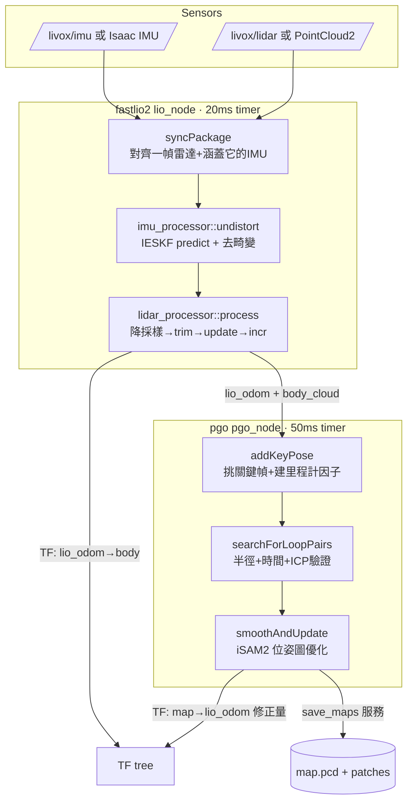

# FAST-LIO2 + PGO：整體演算法流程

> 對象套件:`src/third-party/FASTLIO2_ROS2/`
> - LIO 節點:`fastlio2/src/lio_node.cpp` + `fastlio2/src/map_builder/*`
> - PGO 節點:`pgo/src/pgo_node.cpp` + `pgo/src/pgos/*`
> 深潛筆記(單一函式細節):
> - [`fastlio2-syncpackage.md`](fastlio2-syncpackage.md) — `syncPackage()` 的 `lidar_pushed` 與 `curvature` 排序
> - [`fastlio2-ieskf-update.md`](fastlio2-ieskf-update.md) — IESKF `update()` 的後驗修正數學

這份筆記是「大圖」:從一幀雷達 + 一串 IMU 進來,到吐出里程計、再到 PGO 把長時間漂移拉回來,整條資料流怎麼跑。細節數學請看上面兩篇深潛。

---

## 0. 心智模型:兩層負責不同時間尺度

| 層 | 節點 | 解決什麼 | 時間尺度 |
|---|---|---|---|
| **前端 里程計** | `fastlio2` (LIO) | 「我這一瞬間在哪、朝哪」——高頻、平滑、局部精準 | 每幀 ~50Hz |
| **後端 位姿圖** | `pgo` (PGO) | 「繞了一大圈回到原點,把累積的漂移一次拉正」 | 偵測到回環才動 |

- LIO 像**閉眼走路 + 每步張眼校正牆面**:短時間非常準,但會慢慢累積漂移(走廊走久了整張地圖會歪)。
- PGO 像**認出「我回到剛才來過的地方了」**,於是把整條軌跡重新拉直。它不改 LIO,而是額外發一個 `map → lio_odom` 的修正 TF。

兩者透過 topic 鬆耦合:LIO 發 `body_cloud` + `lio_odom`,PGO 訂閱它們。LIO 不知道 PGO 存在。

---

## 1. 全域資料流



**TF 鏈**:`map --(PGO 修正 offset)--> lio_odom --(LIO 里程計)--> body`
LIO 只負責 `lio_odom→body`;PGO 只負責 `map→lio_odom`。沒有回環時 `map→lio_odom` 是恆等(offset=I)。

---

## 2. FAST-LIO2 前端流程

### 2.1 節點骨架 (`lio_node.cpp`)

- **訂閱**:IMU (`imuCB`) + 雷達。雷達依 `lidar_type` 二選一:
  - `0` = Livox `CustomMsg` (`lidarCB` → `Utils::livox2PCL`)
  - `1` = `sensor_msgs/PointCloud2`,例如 Isaac Sim (`pc2CB` → `Utils::pc2ToPCL`)
- **緩衝**:兩個 deque(`imu_buffer`、`lidar_buffer`),各自上鎖,callback 只負責塞資料。
- **主迴圈**:20ms 的 `timerCB()` 才真正做事(`lio_node.cpp:316`)。
  > ⚠️ 見 README「性能相關」:timer / subscriber / service 共用同一執行緒,機器慢時會互相卡。

`timerCB` 的骨架:

```cpp
if (!syncPackage()) return;              // 湊不到一組完整資料就跳過
m_builder->process(m_package);           // 核心:狀態機 + 融合
if (m_builder->status() != MAPPING) return;
// 發布 odom / tf / body_cloud / world_cloud / path
```

### 2.2 `syncPackage()`:配一組「一幀雷達 + 涵蓋它的 IMU」

一幀雷達掃描約 0.1 秒,期間機器人在動,所以必須等 IMU **補齊到掃描結束時刻** (`cloud_end_time`) 才能處理這一幀,否則無法去畸變。

- `lidar_pushed` 旗標:確保「取出一幀 + 排序 + 算頭尾時間」只做一次,不會每次 timer 都重算。
- 點雲用 `curvature`(實際存的是**逐點時間偏移**,非曲率)排序,去畸變時要依時間順序回捲。
- 詳見 → [`fastlio2-syncpackage.md`](fastlio2-syncpackage.md)。

> Isaac `PointCloud2` 路徑沒有逐點時間,`curvature` 設 0 → 等於**不做去畸變**(見 syncpackage 筆記)。

### 2.3 `MapBuilder::process()`:三態狀態機 (`map_builder.cpp:9`)

```
IMU_INIT ──(收滿 imu_init_num 筆)──> MAP_INIT ──(第一幀點雲入 ikd-Tree)──> MAPPING ──(穩定運行)
```

| 狀態 | 做什麼 |
|---|---|
| `IMU_INIT` | `imu_processor::initialize`:累積 ~20 筆 IMU 算平均,估**重力方向**與**陀螺 bias**,設外參 `r_il/t_il`,初始化協方差 `P`。(`imu_processor.cpp:16`) |
| `MAP_INIT` | 把第一幀去畸變後的點雲轉到世界系,`ikdtree->Build()` 當作初始地圖,沒有 matching。(`map_builder.cpp:20`) |
| `MAPPING` | 每幀都跑 `undistort` + `lidar_processor::process`,正常里程計。 |

### 2.4 `undistort()`:IESKF 前向傳播 + 去畸變 (`imu_processor.cpp:54`)

一次做兩件事:

1. **predict(前向傳播)**:用相鄰兩筆 IMU 的中值 (`0.5*(head+tail)`),一步步 `m_kf->predict(inp, dt, m_Q)` 把狀態往前推進到掃描結束時刻,同時協方差 `P` 變大(愈積愈不確定)。每積分一步拍一張 pose 快照存進 `m_poses_cache`。
2. **去畸變 (motion compensation)**:反向走 `m_poses_cache`,用每個點的時間戳找到「它被打到時感測器在哪」,再把點統一拉回**掃描結束時刻**的座標系。公式:

   ```
   p_compensate = R_il⁻¹ · ( R_wi⁻¹ · (point_rot·(R_il·p + t_il) + point_pos − t_wi) − t_il )
   ```

輸出:一幀「同一時刻對齊」的乾淨點雲 + IESKF 的**先驗**姿態(帶不確定度 `P`)。

### 2.5 `lidar_processor::process()`:scan-to-map 融合 (`lidar_processor.cpp:158`)

四步:

```cpp
// 1. 降採樣:voxel filter,每格 scan_resolution 只留一點,減少點數
m_scan_filter.filter(*m_cloud_down_lidar);

// 2. trimCloudMap:滑動局部地圖窗
trimCloudMap();

// 3. IESKF update:scan-to-map 迭代優化(核心)
m_kf->update();

// 4. incrCloudMap:把新點增量加進 ikd-Tree
incrCloudMap();
```

- **`trimCloudMap()`** (`lidar_processor.cpp:29`):地圖不能無限長大,否則 ikd-Tree 越查越慢。解法是只維護以雷達為中心、邊長 `cube_len`(預設 300m)的立方體局部地圖;機器人逼近邊界 (`move_thresh · det_range` 內) 就整個立方體往前推,並 `Delete_Point_Boxes` 刪掉甩在後面的舊點。

- **`m_kf->update()`** (核心融合):同時最小化「偏離 IMU 先驗多少」+「點離地圖平面多遠」,用 IESKF 迭代解 MAP 估計。量測項的 H/b 由 `updateLossFunc()` 提供——對每個降採樣點在 ikd-Tree 找 `near_search_num` 個鄰居、擬合平面、算點到面距離。
  > 詳見 → [`fastlio2-ieskf-update.md`](fastlio2-ieskf-update.md)。`updateLossFunc` 在 `lidar_processor.cpp:186`。

- **`incrCloudMap()`** (`lidar_processor.cpp:94`):用收斂後的新姿態把當前點投到世界系,依 voxel 中心距離判斷「這點值不值得加」,只把有資訊量的新點塞進 ikd-Tree(避免地圖重複點爆量)。

### 2.6 輸出

`MAPPING` 狀態下每幀發布(`lio_node.cpp:332` 起):
- `lio_odom` (`nav_msgs/Odometry`):姿態 `t_wi / r_wi` + body 系速度 → **PGO 訂閱這個**
- TF `world_frame → body_frame`
- `body_cloud`(body 系)、`world_cloud`(世界系)→ **PGO 訂閱 body_cloud**
- `lio_path`

---

## 3. PGO 後端流程

### 3.1 節點骨架 (`pgo_node.cpp`)

- **同步訂閱**:用 `message_filters::ApproximateTime` 把 `body_cloud` 與 `lio_odom` 依時間戳配對 (`syncCB`),打包成 `CloudWithPose` 推進 `cloud_buffer`。
- **主迴圈**:50ms 的 `timerCB()`:

```cpp
CloudWithPose cp = m_state.cloud_buffer.front();  // 拿最舊一筆
// ...清空整個 buffer(只處理最新代表,不逐幀堆積)...
if (!m_pgo->addKeyPose(cp)) { sendBroadCastTF(...); return; }  // 非關鍵幀:只發 TF
m_pgo->searchForLoopPairs();   // 找回環
m_pgo->smoothAndUpdate();      // 圖優化
sendBroadCastTF(...);          // 發 map→local_frame 修正
publishLoopMarkers(...);       // RViz 視覺化回環邊
```

- **服務**:`/pgo/save_maps` 存地圖(見 3.5)。

### 3.2 關鍵幀挑選 `isKeyPose()` / `addKeyPose()` (`simple_pgo.cpp:21`)

不是每幀都進位姿圖(太密會爆)。只有相對上一個關鍵幀**位移 > `key_pose_delta_trans`** 或 **轉角 > `key_pose_delta_deg`** 才收為新節點。

每收一個關鍵幀就往 GTSAM 因子圖加約束:
- **第 0 幀** → `PriorFactor`(絕對約束,noise 極小 `1e-12`):釘死原點。
- **之後每幀** → `BetweenFactor(idx-1, idx)`(相對約束):宣告「從上一關鍵幀到這幀的相對位姿是這個」,由 LIO 里程計提供。

> **`m_r_offset / m_t_offset` 的角色**:因子圖是在 global(map)座標系運作的,但 LIO 給的是 local(lio_odom)座標。新節點初始值要先套上一輪優化算出的 offset:`init = offset ∘ local`,才會落在跟其他節點一致的座標系。offset 就是 `map→lio_odom` 那個 TF。

### 3.3 回環偵測 `searchForLoopPairs()` (`simple_pgo.cpp:117`)

三道門檻,一關比一關嚴:

1. **軌跡夠長**:`m_key_poses.size() >= 10`,且距上次回環超過 `min_loop_detect_duration`(冷卻)。
2. **空間近 + 時間遠**:用當前幀位置在所有舊關鍵幀上做 KD-Tree 半徑搜尋 (`loop_search_radius`),候選中還要求時間相差 `> loop_time_tresh`(預設 60s)——排除「剛剛才路過」的假回環。
   > `{TODO}` 程式註記:每次都重建整顆 KD-Tree,是潛在效能點。
3. **點雲驗證 (ICP)**:光位置近還不夠(兩條不同走廊可能剛好靠近)。取舊幀的**子地圖**(前後各 `loop_submap_half_range` 幀疊起來降採樣,`getSubMap`)當 target,當前幀當 source,跑 ICP 對齊。只有 `hasConverged()` 且 `fitnessScore < loop_score_tresh` 才承認。

承認後把 ICP 修正換算成「source 相對 target 的相對位姿」,存進 `m_cache_pairs`,等優化時加成回環因子。

### 3.4 位姿圖優化 `smoothAndUpdate()` (`simple_pgo.cpp:211`)

- 若本輪有回環,把 `m_cache_pairs` 的 `BetweenFactor(target, source)` 加進圖(noise 用 ICP 的 fitness score,分數越差越不信)。
- 呼叫 **iSAM2**(增量式平滑建圖,內部用 Bayes Tree 只重線性化受影響部分,不整圖重解)。有回環時多跑幾次 `update()` 讓修正充分傳播。
- 把最佳估計寫回每個關鍵幀的 `r_global / t_global`。
- **重算 offset**:`m_r_offset = r_global · r_localᵀ`、`m_t_offset = t_global − offset·t_local`。這就是下一輪要廣播的 `map→lio_odom` 修正量——回環的效果透過這個 TF **一次性反映到全域**,而不用去動 LIO。

### 3.5 存地圖 `/pgo/save_maps` (`pgo_node.cpp:238`)

服務參數 `file_path` + `save_patches`,輸出:
- `map.pcd`:所有關鍵幀 body 點雲用最終 `r_global/t_global` 轉到世界系疊成的完整地圖。
- `patches/*.pcd` + `poses.txt`(當 `save_patches=true`):逐幀分片點雲 + 位姿清單。
  > **後續一致性優化(BLAM/HBA)需要 `save_patches=true`**;HBA 現階段先擱置。

---

## 4. 關鍵參數速查

### LIO (`fastlio2/config/lio.yaml`)

| 參數 | 預設 | 作用 |
|---|---|---|
| `lidar_type` | 0 | 0=Livox CustomMsg / 1=PointCloud2 (Isaac) |
| `imu_acc_scale` | 10.0 | Livox IMU 回報 g → ×10 變 m/s²;Isaac 已是 m/s² 要設 **1.0** |
| `scan_resolution` | 0.15 | 當幀點雲降採樣 voxel |
| `map_resolution` | 0.3 | ikd-Tree 地圖 voxel |
| `cube_len` / `det_range` / `move_thresh` | 300 / 60 / 1.5 | 局部地圖滑動窗 |
| `imu_init_num` | 20 | IMU 初始化取樣數 |
| `near_search_num` | 5 | 平面擬合鄰居數 |
| `ieskf_max_iter` | 5 | IESKF 迭代上限 |
| `gravity_align` | true | 用重力對齊初始姿態 |
| `esti_il` | false | 是否線上估雷達-IMU 外參 |
| `lidar_cov_inv` | 1000 | 雷達量測可信度(越大越信雷達) |

### PGO (`pgo/config/pgo.yaml`)

| 參數 | 預設 | 作用 |
|---|---|---|
| `key_pose_delta_trans` / `_deg` | 0.5m / 10° | 關鍵幀挑選門檻 |
| `loop_search_radius` | 1.0 | 回環候選空間半徑 |
| `loop_time_tresh` | 60.0 | 回環候選最小時間差(排除剛路過) |
| `loop_score_tresh` | 0.15 | ICP fitness 門檻(越小越嚴) |
| `loop_submap_half_range` | 5 | target 子地圖前後幀數 |
| `submap_resolution` | 0.1 | 子地圖降採樣 |
| `min_loop_detect_duration` | 5.0 | 兩次回環偵測冷卻 |

---

## 5. 啟動與串接(對照 README)

```bash
# 前端里程計
ros2 launch fastlio2 lio_launch.py
# 後端回環(訂閱 LIO 的 body_cloud + lio_odom)
ros2 launch pgo pgo_launch.py
# 存地圖(要後續 HBA 就 save_patches: true)
ros2 service call /pgo/save_maps interface/srv/SaveMaps \
  "{file_path: 'your_dir', save_patches: true}"
```

> 本 workspace 的 Isaac Sim 串接用 `lio_isaac.yaml` / `pgo_isaac_launch.py`,topic/frame 會加上 `<robot_id>/` 前綴,frame 鏈為 `map → lio_odom → body`。
